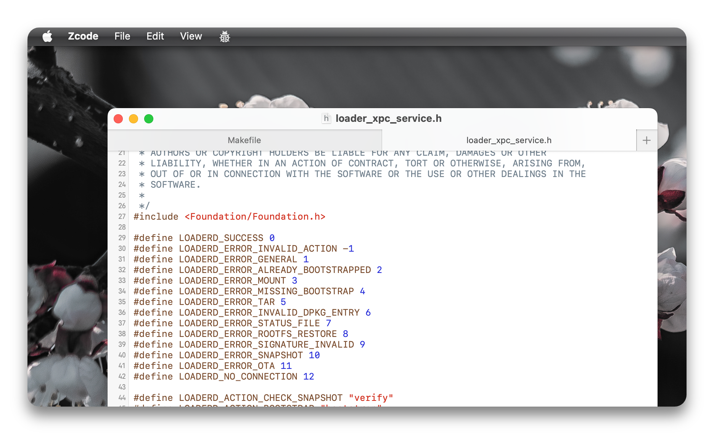

# Wcode

welcome to the 4th dimension of programming

## Preview

<p align="center">
    <picture>
        <source media="(prefers-color-scheme: dark)" srcset="Images/dark.png">
        <source media="(prefers-color-scheme: light)" srcset="Images/light.png">
        
    </picture>
</p>

## Build

```sh
git clone https://github.com/darwinx64/Wcode.git
cd Wcode-main
xcodebuild CODE_SIGN_IDENTITY="" CODE_SIGNING_REQUIRED=NO
open ./packages
```

1. Clone
2. CD
3. Build without signing (or do)
4. Open the build dir in finder

Alternatively, a one-liner

```sh
git clone https://github.com/darwinx64/Wcode.git; cd Wcode-main; xcodebuild CODE_SIGN_IDENTITY="" CODE_SIGNING_REQUIRED=NO; open ./packages
```
